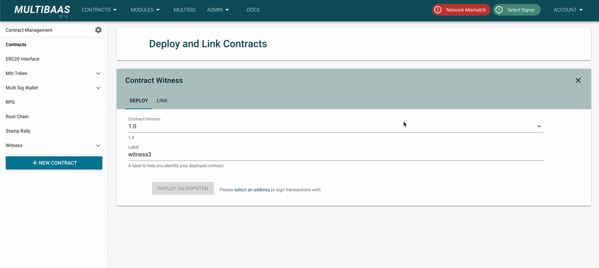
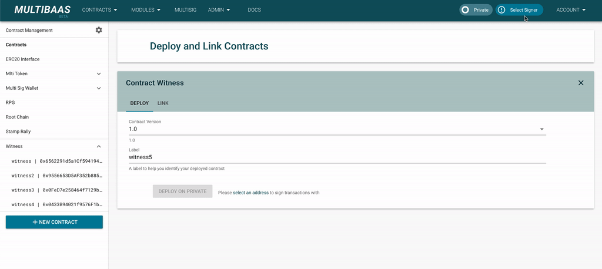

# Mock3


Mock3 is a wrapper using [ethers.js](https://github.com/ethers-io/ethers.js) to help developing and running UI tests for dApps on Ethereum.
This can connect an actual blockchain network such as [Rinkeby](https://www.rinkeby.io/), [Infura](https://infura.io/) and [Ganache](https://www.trufflesuite.com/ganache).

Major good things of Mock3 are that it can see actual blockchain result(block number, transaction hash and so forth) generated by Ethereum node, and if you combine this with your local Ethereum node (necessary to reset chaindata or just [use Ganache](start-ganache.sh)) it will be acting like a static mock at every test.

Currently, very limited number of features are covered but it will be better later. (Think positively 💡)

## Usage

First, install a package:

```sh
yarn add --dev mock3
```

or if you are using npm:

```sh
npm install --save-dev mock3
```

Second, create a new Mock3 in your source code.
You can select one of ways below:

```js
// Rinkeby network will be set as default
const web3 = new Mock3();

// Set JSON RPC using Infura, Ganache, or your own
const web3 = new Mock3('YOUR.RPC.URL');
```

_You can use `if` branch using `NODE_ENV` or your own way to select which web3 will be used._

```js
let web3;
if (NODE_ENV === 'test') {
  web3 = new Mock3('YOUR.RPC.URL');
} else {
  web3 = window.web3; // or something you want
}
```

Third, set signers you want to use using private keys.
You can select one of ways below:

```js
// Set a signer with a single private key
web3.setSigner('0x3afe...');

// Set signers with private key array
web3.setSigner(['0x3afe...', '0xf2f1...']);
```

You can set a specific account enabled only using `setAccountIndex()` like real behavior of selecting from [MetaMask](https://metamask.io/) or just retrieve all accounts.

```js
// Retrieve all accounts set by you
web3.setAccountIndex(null); // or no set at all after creating first
const accounts = await listAccounts();

// Just retrieve an account in index 2
web3.setAccountIndex(2);
const account = await listAccounts();
```

## Before and After using Mock3

Before:



After:

You will be free from clicking bunch of MeteMask popups during the development and to add any UI tests related to transactions.



## Development

Clone this repo and link it as a npm package:

```sh
git https://github.com/curvegrid/mock3.git
cd mock3
npm link
```

Then you can add it as a local package in your project:

```sh
cd path-to-your-project
npm link mock3
```

## Contribution

Anything is welcome. 👋
(DO NOT FORGET to add tests for the new PR)
